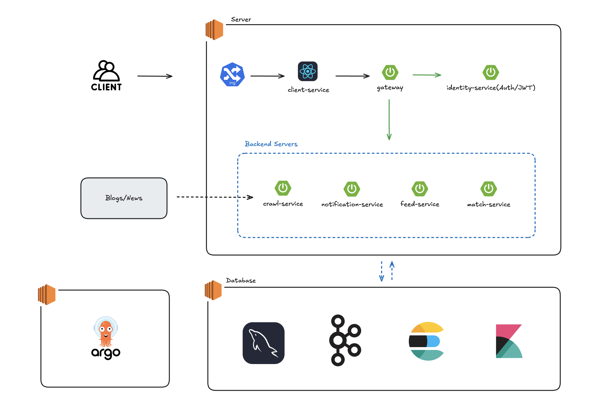
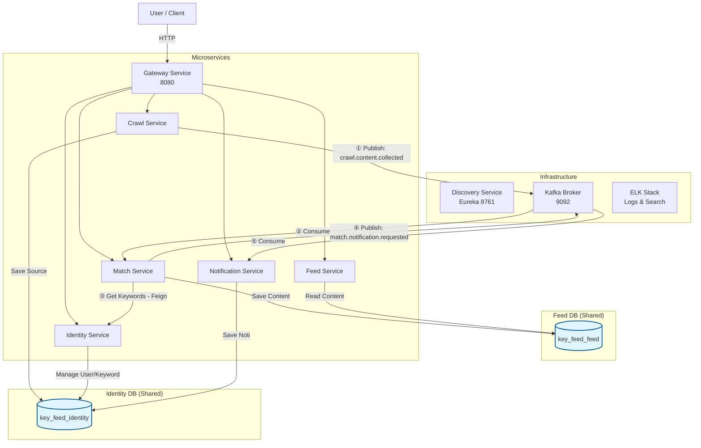
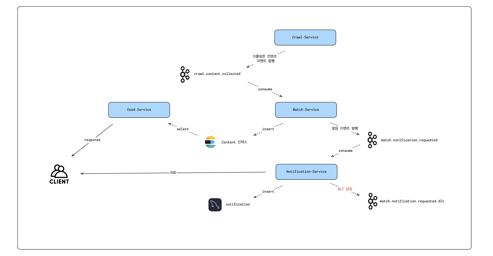
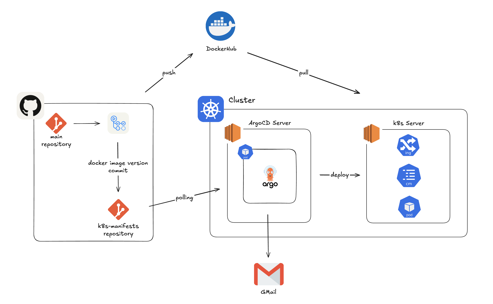

# Key-Feed Project

Key-Feed는 사용자가 관심 있는 키워드와 소스(RSS, 웹사이트)를 등록하면, 관련된 콘텐츠를 수집하고 매칭하여 개인화된 피드와 알림을 제공하는 **MSA 기반 피드 시스템**입니다.

## 🏗 System Architecture

서비스는 역할에 따라 분리되어 있으며 Kafka를 통한 비동기 이벤트 처리와 Feign을 통한 동기 통신을 혼합하여 유기적으로 동작합니다.

 

## 🧩 Services & Workflow

각 마이크로서비스는 고유한 책임을 가지며 아래와 같은 흐름으로 데이터를 처리합니다.

### 1. 🕷️ Crawl Service
*   **역할**: 등록된 소스(RSS 등)를 주기적으로 크롤링하여 새로운 콘텐츠를 수집합니다.
*   **Workflow**:
    1.  스케줄러가 구독 중인 `Source` 목록을 확인합니다.
    2.  새로운 글이 발견되면 파싱하여 객체화합니다.
    3.  Kafka Topic `crawl.content.collected`으로 크롤링 된 콘텐츠 이벤트를 발행합니다.

### 2. 🧩 Match Service
*   **역할**: 수집된 콘텐츠를 분석하고 사용자의 관심 키워드와 매칭합니다.
*   **Workflow**:
    1.  Kafka에서 콘텐츠 이벤트를 소비(Consume)합니다.
    2.  콘텐츠를 **Feed DB**에 저장하여 영구 보관합니다.
    3.  콘텐츠의 내용을 분석하여 키워드를 추출합니다.
    4.  **Identity Service**에게 Feign Client로 요청을 보내, 해당 키워드를 구독 중인 유저 목록을 조회합니다.
    5.  매칭된 유저가 있다면 Kafka Topic `match.notification.requested`으로 알림 이벤트를 발행합니다.

### 3. 🔔 Notification Service
*   **역할**: 유저에게 알림을 생성하고 전송합니다.
*   **Workflow**:
    1.  Kafka에서 알림 요청 이벤트를 소비합니다.
    2.  **Identity DB**의 `notification` 테이블에 알림 내역을 저장합니다.
    3.  (확장 예정) FCM/Email 등을 통해 실시간 푸시 알림을 전송합니다.

### 4. 📰 Feed Service
*   **역할**: 사용자에게 수집 및 매칭된 콘텐츠를 조회하는 API를 제공합니다.
*   **Workflow**:
    1.  Frontend 요청 시 **Feed DB**에서 콘텐츠를 조회합니다.
    2.  사용자별 맞춤 피드 데이터를 구성하여 반환합니다.

### 5. 🆔 Identity Service
*   **역할**: 사용자 인증(Auth), 프로필 관리, 관심사(키워드/소스) 설정을 담당합니다.
*   **Data**: 유저 정보, 키워드, 구독 소스, 북마크 등을 관리합니다.

 

## CI/CD Pipeline

GitHub Actions를 이용하여 변경된 서비스만 감지하고, 빌드 및 배포하는 효율적인 파이프라인을 구축했습니다.

1.  **Change Detection (변경 감지)**:
    -   `dorny/paths-filter`를 사용하여 Push된 커밋에서 변경사항이 발생한 서비스(Module)를 자동으로 감지합니다.
    -   변경되지 않은 서비스는 빌드 과정을 건너뛰어 자원을 절약합니다.

2.  **Build & Test (빌드 및 테스트)**:
    -   Backend: JDK 17 환경에서 Gradle을 사용하여 빌드 및 테스트를 수행합니다.
    -   Frontend: Node.js 환경에서 빌드합니다.

3.  **Dockerize & Push (이미지 생성 및 푸시)**:
    -   서비스별 Docker Image를 생성하고 Docker Hub에 `latest`와 `commit-sha` 태그로 푸시합니다.

4.  **GitOps Deployment (배포)**:
    -   K8s Manifest Repository(`k8s-repo`)를 Clone 하여 `deployment.yaml`의 이미지 태그를 최신 Commit SHA로 업데이트합니다.
    -   변경 사항이 Push 되면 ArgoCD가 이를 감지하여 Kubernetes 클러스터에 자동으로 동기화(Sync)합니다.

 

## 💾 Database Structure

이 프로젝트는 효율적인 데이터 관리를 위해 두 개의 물리적 데이터베이스를 논리적으로 분리하여 사용합니다.

 

### 🗄️ Identity DB (`key_feed_identity`) - MySQL
사용자 정보와 메타데이터를 관리하며, **Identity, Crawl, Notification** 서비스가 공유합니다.

| Table Name | Description | Related Service |
| :--- | :--- | :--- |
| `user` | 사용자 계정 정보 (Email, PWD, Role) | Identity |
| `keyword` | 사용자가 등록한 관심 키워드 | Identity |
| `source` | 크롤링 대상 URL 및 메타데이터 | Identity, Crawl |
| `user_source` | 사용자와 소스 간의 구독 관계 | Identity |
| `notification` | 사용자별 알림 내역 | Notification |
| `refresh_token` | JWT Refresh Token 저장소 | Identity |

 

### 🗄️ Feed DB (`key_feed_feed`) - Elasticsearch
대용량 콘텐츠 데이터를 검색 및 분석하기 위해 Elasticsearch를 사용하며, **Match, Feed** 서비스가 공유합니다.

| Index Name | Description | Related Service |
| :--- | :--- | :--- |
| `content` | 크롤링 된 기사/블로그 포스트 원본 데이터 | Match, Feed |

 

## 🛠 Tech Stack

### Backend
- **Language**: Java 17
- **Framework**: Spring Boot 3.x, Spring Cloud (Eureka, Gateway, OpenFeign)
- **Database**: MySQL (JPA/Hibernate)
- **Messaging**: Apache Kafka (KRaft mode)
- **Search & Log**: ELK Stack (Elasticsearch, Logstash, Kibana)
- **Security**: Spring Security, JWT, Jasypt

### Frontend
- **Framework**: React, Vite
- **Styling**: TailwindCSS

### AI & Development Tools
- **AI Assistant**: Antigravity, Claude Code
